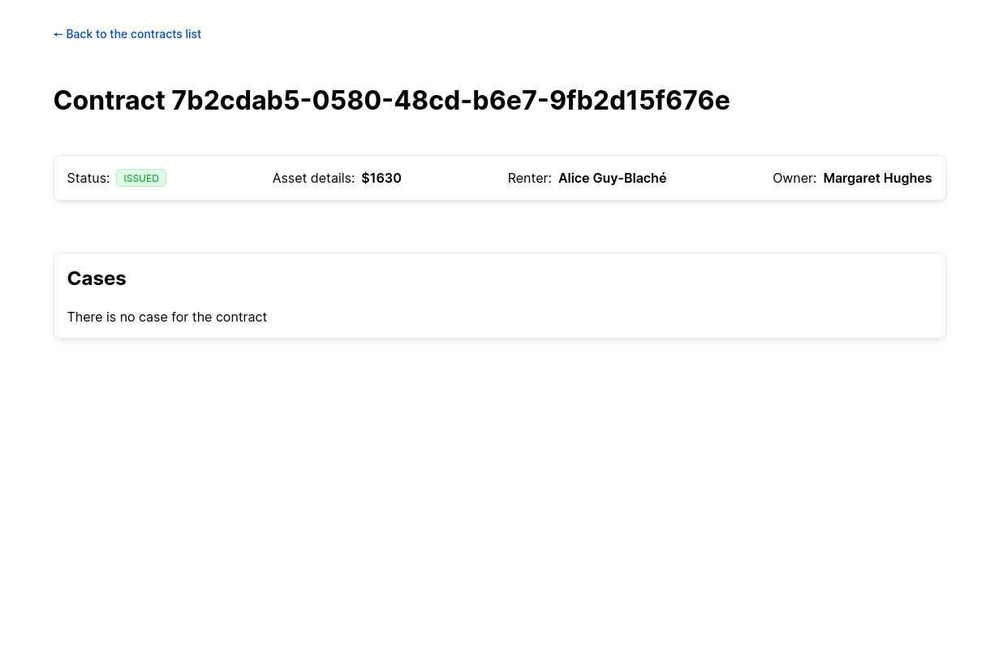

# Mid-Level Engineer

Welcome to the Tint technical test for mid-level engineers!

First of all, don't stress! This test is not a trap. It is designed to check that you are able to implement a feature without fully detailed implementation steps. As in a real-world situation, you have access to all available resources (including of course Google, Stack Overflow, etc.).

And, if you are really stuck, don't hesitate to ping your interviewer. They are here to help!

This test lasts 2 hours, please inform your recruiter when you are done. If you are successful, we'll follow-up with a 45 minutes debrief with one of our engineers.

## Setup the Project

This project uses Next. You can either run it in docker or on your machine.

### Docker

First, install the dependencies and start the app:

```shell
yarn install:docker
yarn start:docker
```

Then, in another terminal, as the docker containers are now running, initialize the database:

```shell
yarn migrate:docker
```

### Local

If you choose to run the project locally, you will need to have a postgres server running. Once it's setup, create a `.env` file with the following content, edited to point to your database:

```shell
DB_HOST=localhost
DB_PORT=5432
DB_USER=tint
DB_NAME=tint
DB_PASSWORD=tint
```

Then, install the dependencies and start the app:

```shell
yarn install
yarn start
```

Then, in another terminal, initialize the database:

```shell
yarn migrate
```

You can now access [http://localhost:3000](http://localhost:3000), and see the contracts list. Your test starts here.

## A note on the commands

All the commands for this project can be found in `package.json`. Each command runs on your machine, but can be suffixed with `:docker` to be run in docker instead. If you choose to run the command in docker, you need to make sure the containers are running first by running `yarn start:docker`, except for `yarn install:docker` (More on that bellow).

### `yarn install:docker`

This install the dependencies through docker. It is one of the only two docker commands that don't require the containers to be running first.

### `yarn start` and `yarn start:docker`

This starts the web application.
Running it with `:docker` will start both the database container and the web application container. They will then run in the terminal, so you will need to open a new terminal/tab if you want to run more commands.

### `yarn reset` and `yarn reset:docker`

This downgrades the database to have it reset to a blank state. It can be used to revert the database to a blank state in case of a problem, as running the migrate command afterward will re-update the base and re-seed it. If ran through docker, you will need to have started the containers with `yarn start:docker` in another terminal first.

## Objective

Your objective is to add a list of cases in the [contract details page](http://localhost:3000/contract/e8fc8982-08ae-41d0-8ae0-4690967f26dd). The cases list should be retrieved through a new API endpoint in `api/contracts/[id]/cases`. At the end of the technical test, the page should look like this:

|  |  |
| ---------------------------------------------- | ------------------------------------------------ |
| A contract with no case                        | A contract with two cases                        |

The database comes with three pre-existing contracts:

- [A draft with no case](http://localhost:3000/contract/4f9167af-95f4-4c46-b964-b2e54cc2906f)
- [An issued contract with no case](http://localhost:3000/contract/7b2cdab5-0580-48cd-b6e7-9fb2d15f676e)
- [An issued contract with two cases](http://localhost:3000/contract/4f9167af-95f4-4c46-b964-b2e54cc2906f)

Note that this project uses [Vanilla Extract](https://vanilla-extract.style/) for its styling.

Good luck!
